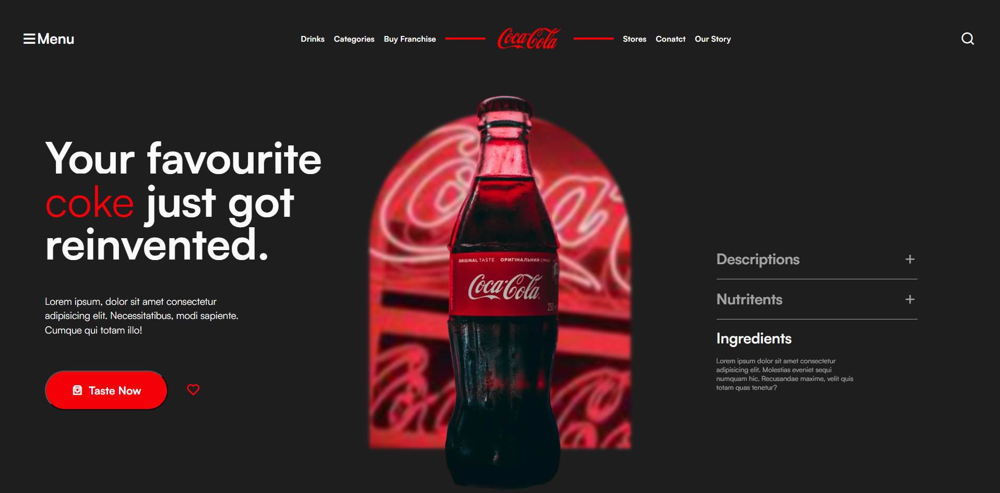

# Coca-Cola Webpage

This project is a simple, responsive webpage for Coca-Cola that showcases the brand's offerings and allows users to learn more about their favorite drink. The design is modern, using CSS for styling and leveraging icons from Remix Icon.

## Features

- **Responsive Navigation**: A clean navigation menu that adapts to different screen sizes.
- **Interactive Elements**: Buttons and icons to enhance user experience.
- **Content Sections**: Sections for descriptions, nutrients, and ingredients of the product.
- **Visual Design**: Attractive layout with a background image and a prominent Coca-Cola logo.

## Screenshots

### Desktop View



## Technologies Used

- **HTML**: Structure of the webpage.
- **CSS**: Styling and layout.
- **FontShare**: Custom fonts for a modern look.
- **Remix Icons**: Icon library for visually appealing icons.

## Installation

To view the project, clone this repository and open the `index.html` file in your browser:

```bash
git clone https://github.com/CodeWithZishan/coca_cola.git
cd coca_cola
open index.html
```

## File Structure

```
coca-cola/
├── images/                  # Contains images used in the project
│   ├── coca-cola.webp      # Coca-Cola logo
│   ├── bottle.webp         # Coca-Cola glass bottle image
│   ├── background.jpeg      # Background image for the center section
│   └── screenshot.png       # Screenshot of the webpage
├── style.css               # Styles for the webpage
└── index.html              # Main HTML file
```

## Usage

- Open `index.html` in your preferred web browser to view the Coca-Cola webpage.
- Click on the buttons and explore the different sections to learn more about Coca-Cola.

## Contributing

If you want to contribute to this project, feel free to fork the repository and submit a pull request.

## License

This project is open source and available under the [MIT License](LICENSE).
```

Feel free to customize it further if needed!
